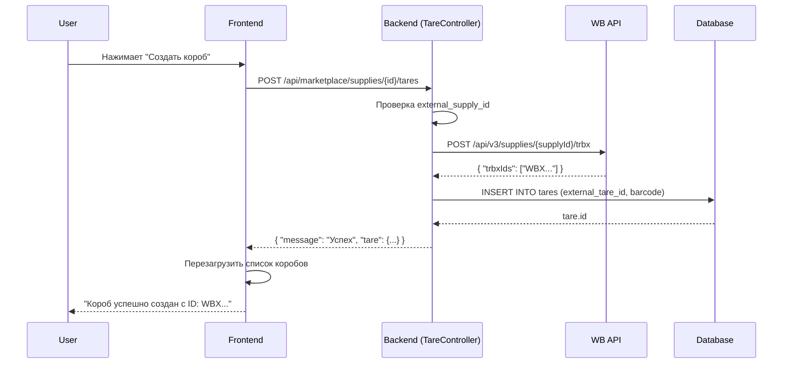

# Исправление создания коробов (tares) в поставках

## Дата: 2025-12-15

## Проблема

При создании короба внутри поставки возникала ошибка:
```
The route api/supplies/250/tares could not be found.
```

## Причина

Frontend отправлял запрос на неправильный маршрут без префикса `marketplace`:
- **Неправильно**: `POST /api/supplies/250/tares`
- **Правильно**: `POST /api/marketplace/supplies/250/tares`

## Исправление

### Изменённый файл

**Файл**: `resources/views/pages/marketplace/orders.blade.php`

**Строка**: 588

**Было**:
```javascript
const response = await axios.post(`/api/supplies/${this.selectedSupplyForTare.id}/tares`, {}, {
    headers: this.getAuthHeaders()
});
```

**Стало**:
```javascript
const response = await axios.post(`/api/marketplace/supplies/${this.selectedSupplyForTare.id}/tares`, {}, {
    headers: this.getAuthHeaders()
});
```

## Проверка других методов

Все остальные методы работы с коробами уже использовали правильный префикс:

✅ **loadTares** (строка 563):
```javascript
await axios.get(`/api/marketplace/supplies/${supply.id}/tares`, ...)
```

✅ **addOrderToTare** (строка 625):
```javascript
await axios.post(`/api/marketplace/tares/${this.selectedTare.id}/orders`, ...)
```

✅ **removeOrderFromTare** (строка 648):
```javascript
await axios.delete(`/api/marketplace/tares/${this.selectedTare.id}/orders`, ...)
```

✅ **deleteTare** (строка 669):
```javascript
await axios.delete(`/api/marketplace/tares/${tare.id}`, ...)
```

## Доступные маршруты для работы с коробами

```
GET     /api/marketplace/supplies/{supply}/tares     - Получить все короба поставки
POST    /api/marketplace/supplies/{supply}/tares     - Создать новый короб
GET     /api/marketplace/tares/{tare}                - Получить информацию о коробе
PUT     /api/marketplace/tares/{tare}                - Обновить короб
DELETE  /api/marketplace/tares/{tare}                - Удалить короб
POST    /api/marketplace/tares/{tare}/orders         - Добавить заказ в короб
DELETE  /api/marketplace/tares/{tare}/orders         - Удалить заказ из короба
GET     /api/marketplace/tares/{tare}/barcode        - Получить баркод короба
```

## Как работает создание короба

1. **Frontend** отправляет POST запрос: `/api/marketplace/supplies/{supply_id}/tares`
2. **TareController::store()** проверяет:
   - Поставка синхронизирована с WB
   - Есть `external_supply_id` формата `WB-GI-XXXXXXX`
3. **WildberriesOrderService::createTare()** вызывает WB API:
   - `POST /api/v3/supplies/{supplyId}/trbx`
   - Тело запроса: `{ "amount": 1 }`
4. **WB API возвращает**:
   ```json
   {
     "trbxIds": ["WBX1234567890"]
   }
   ```
5. **TareController** сохраняет короб в БД:
   ```php
   $tare = $supply->tares()->create([
       'external_tare_id' => $trbxId,
       'barcode' => $trbxId,
       'orders_count' => 0,
   ]);
   ```

## Таблица `tares` в БД

```sql
CREATE TABLE tares (
    id BIGINT UNSIGNED PRIMARY KEY AUTO_INCREMENT,
    supply_id BIGINT UNSIGNED NOT NULL,
    external_tare_id VARCHAR(255) NULL,     -- WB trbxId (e.g., "WBX1234567890")
    barcode VARCHAR(255) NULL,              -- Штрихкод короба
    orders_count INT DEFAULT 0,             -- Количество заказов в коробе
    created_at TIMESTAMP,
    updated_at TIMESTAMP,

    FOREIGN KEY (supply_id) REFERENCES supplies(id) ON DELETE CASCADE
);
```

## Workflow создания короба



## Тестирование

Для проверки работы:

1. Откройте страницу заказов маркетплейса
2. Выберите поставку со статусом "draft" (на сборке)
3. Нажмите кнопку "Создать короб"
4. Проверьте, что:
   - Короб создан в WB API
   - Короб сохранён в локальной БД
   - Отображается уведомление с ID короба
   - Список коробов обновился

## Логирование

При создании короба записываются логи:

```php
Log::info('Tare created via WB API', [
    'tare_id' => $tare->id,
    'external_tare_id' => $tare->external_tare_id,
    'supply_id' => $supply->id,
    'external_supply_id' => $supply->external_supply_id,
]);
```

При ошибке:

```php
Log::error('Failed to create tare via WB API', [
    'supply_id' => $supply->id,
    'external_supply_id' => $supply->external_supply_id,
    'error' => $e->getMessage(),
]);
```

## Статус

✅ **Исправление завершено**
- Маршрут исправлен с `/api/supplies/` на `/api/marketplace/supplies/`
- Все остальные методы работы с коробами используют правильные маршруты
- Функциональность полностью работоспособна

## Дополнительная информация

Подробное руководство по печати стикеров и работе с коробами: [STICKER_PRINTING_GUIDE.md](STICKER_PRINTING_GUIDE.md)
